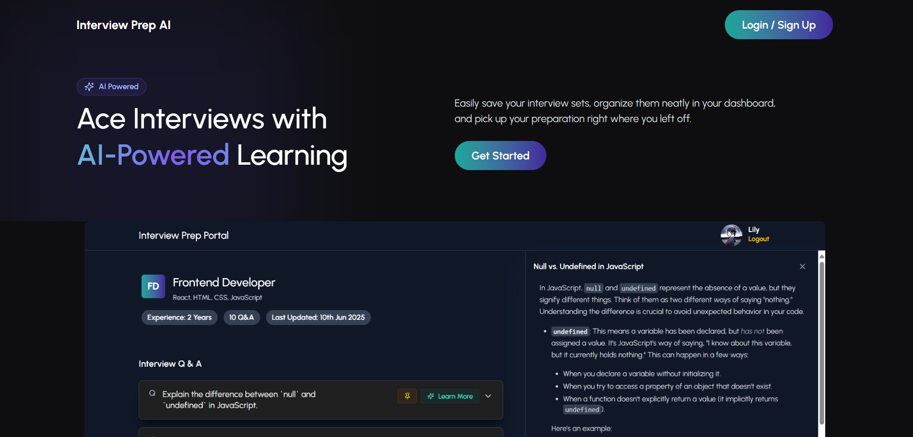
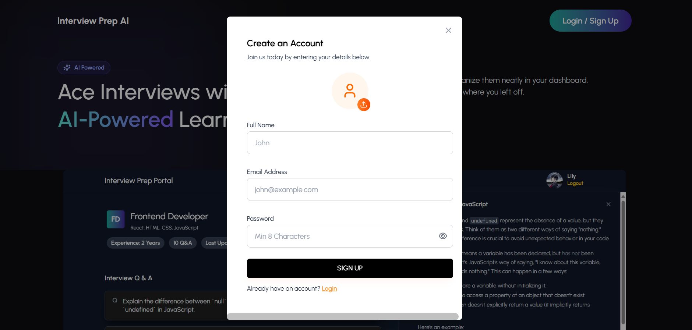
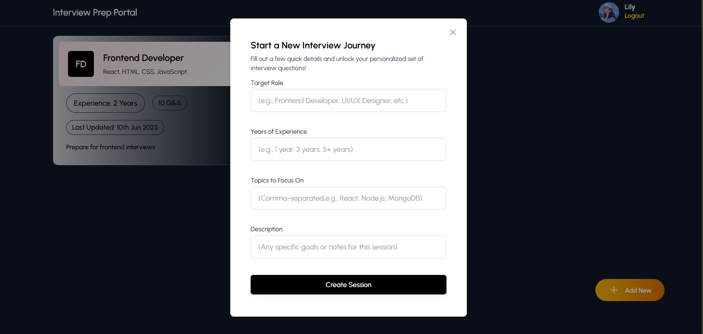
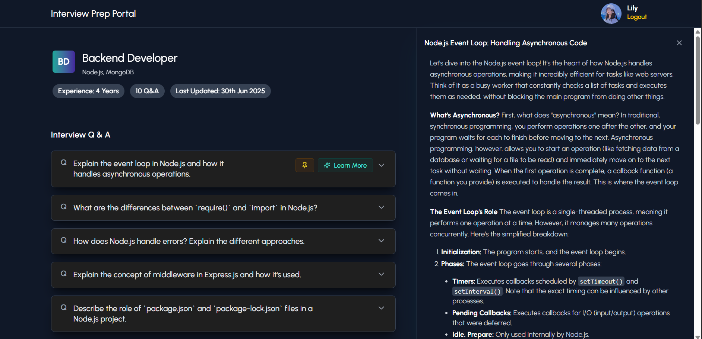

# AI Based Interview PrepPortal

A personalized AI-powered platform to prepare for technical interviews by generating dynamic questions, answers, and explanations based on user roles and experience levels.

---

## 🚀 Features

- 🔐 **User Authentication** – Secure login & registration using JWT.
- 🧠 **AI-Powered Interview Q&A** – Generate role-specific questions and answers using the Gemini API.
- 🗂️ **Accordion-Based UI** – Clean and expandable Q&A interface for focused learning.
- 📌 **Pin Important Questions** – Bookmark crucial questions for quick review.
- 📝 **AI Concept Explanations** – On-demand AI-generated concept breakdowns.
- 📒 **Session History** – Save and revisit previous interview sessions.
- 💾 **MongoDB Integration** – Persistent storage for sessions and pinned content.
- 🖼️ **Modern Frontend** – TailwindCSS + React for a responsive, smooth user experience.

---

## 👁️ Preview

### > Landing Page


### > Registration Form


### > Create Session Form


### > Dashboard


### > Interview Page


---
## 🛠️ Tech Stack

- **Frontend:** React, Tailwind CSS, JavaScript  
- **Backend:** Node.js, Express.js  
- **Database:** MongoDB  
- **AI Integration:** Gemini API  
- **Authentication:** JWT (JSON Web Tokens)  

---

## 🔧 Getting Started

### 1. Clone the Repository

```bash
git clone https://github.com/Vishalsahu1510/Ai-Interview-Prep.git
cd InterviewPrepPortal
```

### 2. Setup Backend

```bash
cd backend
npm install
npm run dev
```

Create a `.env` file in the backend directory with the following:

```env
MONGO_URI=your_mongodb_connection_string
JWT_SECRET=your_jwt_secret_key
PORT=5000
CLOUDINARY_CLOUD_NAME=
CLOUDINARY_API_KEY=
CLOUDINARY_API_SECRET=
```

### 3. Setup Frontend

```bash
cd ../frontend/InterviewPrepPortal
npm install
npm run dev
```

## 🌐 Live Demo

Check out the live app here: https://ai-interview-prep-rahg.vercel.app/
